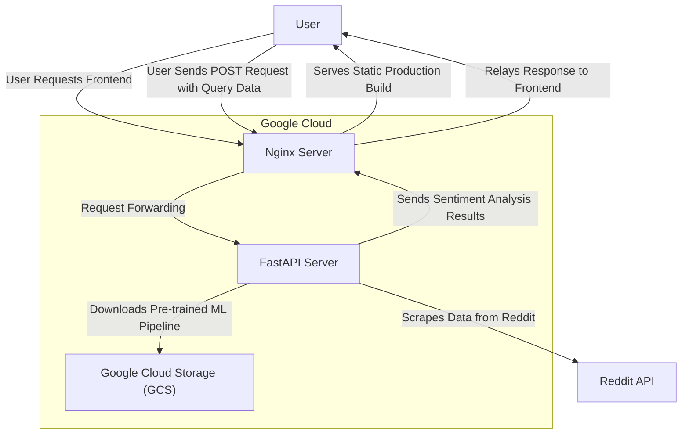

# Topic Sentiment Analyzer Client


## Description

This client is a web application that allows users to input a common term or phrase and see a sentiment analysis of social media involving the input.

Features include:

- Real-time sentiment analysis of social media posts and comments
- Pie chart visualization of sentiment distribution

Technologies used:

- React
- TanStack Router
- Tailwind CSS
- Vite
- Docker
- Nginx

The backend server's source code can be found in the [topic-sentiment-analyzer-server](https://github.com/leinadest/topic-sentiment-analyzer-server) repository.

## Data Flow



1. **User Requests Frontend**: The user accesses the frontend via a Nginx cloud run server (this repository), which serves a static production build of the frontend.

2. **User Sends Data**: The user submits a POST request with query data to the Nginx server.

3. **Request Forwarding**: The Nginx server acts as a reverse proxy, forwarding the request to the backend FastAPI cloud run server for processing.

4. **Backend Processing**: The FastAPI server performs several tasks:

   1. Downloads a pre-trained machine learning pipeline from Google Cloud Storage (GCS).
   2. Scrapes data from Reddit using the asyncpraw library.
   3. Runs the pipeline's sentiment analysis on the scraped data.

5. **Response to User**: The FastAPI server sends the inference results back to the client Nginx server, which then relays the response to the user's frontend.

## Installation

1. Clone the repository:

   ```bash
   git clone https://github.com/leinadest/topic-sentiment-analyzer-client.git
   ```

2. Install dependencies:

   ```bash
   cd topic-sentiment-analyzer-client
   npm install
   ```

3. Env file:

   ```bash
   # .env

   # Backend server URL (ex. http://localhost:8000)
   VITE_API_URL=http://localhost:8000
   ```

## Usage

1. Start the backend server

2. Start the development frontend server:

   ```bash
   npm run dev
   ```

3. Access the application at http://localhost:5173

## Deployment

The project is deployed on Google Cloud Run and is accessible at the following link:

[Live Demo](https://topic-sentiment-analyzer-client-148621174923.us-central1.run.app/)
